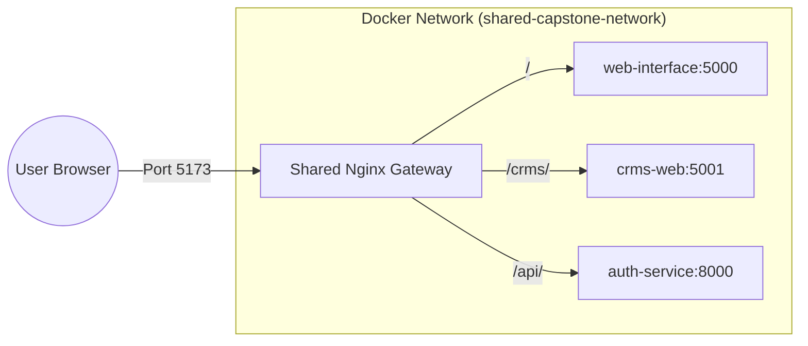

# Shared Gateway & Nginx Reverse Proxy Guide

This document explains the concept, benefits, and implementation of the **Shared Gateway** (Nginx Reverse Proxy) used in our microservices architecture.

---

## 1. How it Works

A **Reverse Proxy** acts as an intermediary for requests from clients (browsers) seeking resources from backend servers. In our setup, the **Shared Gateway** is the single entry point for all frontend applications.

### Request Flow
1. The **User** accesses the application via a single port (e.g., `5173`).
2. **Nginx** receives the request and examines the URL path.
3. **Nginx** matches the path to a specific service (e.g., `/` for Auth, `/crms/` for CRMS).
4. **Nginx** forwards the request to the internal Docker service name (e.g., `http://web-interface:5000`).
5. The **Service** processes the request and sends the response back to Nginx.
6. **Nginx** delivers the response to the User.



---

## 2. Benefits of a Shared Gateway

| Benefit | Description |
| :--- | :--- |
| **Single Entry Point** | Users only need to know one URL/Port. No more managing `localhost:5000`, `localhost:5001`, etc. |
| **Abstraction** | Backend service names and internal ports are hidden from the public internet. |
| **Cross-Origin (CORS)** | Since everything is on the same domain/port, you avoid many CORS-related headaches. |
| **SSL Termination** | You can configure SSL (HTTPS) once at the gateway level instead of every service. |
| **Request Routing** | Easily route traffic based on path prefixes (e.g., `/api/v1/`, `/admin/`). |

---

## 3. Current Implementation Details

Our gateway is defined in the `auth-module` project as the `nginx-proxy` service.

- **Image**: `nginx:alpine`
- **Exposed Port**: `5173`
- **Network**: `shared-capstone-network` (external)

### Nginx Configuration (`nginx.conf`)
```nginx
server {
    listen 5173;

    # Auth module web interface at root
    location / {
        proxy_pass http://web-interface:5000;
        proxy_http_version 1.1;
        proxy_set_header Upgrade $http_upgrade;
        proxy_set_header Connection "upgrade";
        proxy_set_header Host $host;
    }

    # CRMS frontend at /crms/
    location /crms/ {
        proxy_pass http://crms-web:5001;
        proxy_http_version 1.1;
        proxy_set_header Upgrade $http_upgrade;
        proxy_set_header Connection "upgrade";
        proxy_set_header Host $host;
    }
}
```

---

## 4. How to Set Up for Other Services

To add a new service to the gateway, follow these three steps:

### Step 1: Ensure Shared Network
Your new service must be part of the `shared-capstone-network` in its `docker-compose.yml`.

```yaml
services:
  my-new-service:
    # ... other config ...
    networks:
      - shared-capstone-network

networks:
  shared-capstone-network:
    external: true
```

### Step 2: Update Nginx Config
Add a new `location` block in `auth-module/nginx/nginx.conf`.

```nginx
# Add this inside the server { ... } block
location /new-service/ {
    proxy_pass http://my-new-service:PORT;
    proxy_http_version 1.1;
    proxy_set_header Upgrade $http_upgrade;
    proxy_set_header Connection "upgrade";
    proxy_set_header Host $host;
}
```

### Step 3: Restart Gateway
Apply the changes by restarting the Nginx container:

```bash
docker compose -f auth-module/docker-compose.yml restart nginx-proxy
```

---

## 5. Troubleshooting Tips

1. **Service Not Found**: Ensure the `proxy_pass` uses the exact `container_name` or `service_name` defined in Docker Compose.
2. **Network Issues**: Check if both the Gateway and the Target Service are on the same `external` network using `docker network inspect shared-capstone-network`.
3. **Path Stripping**: If your backend doesn't expect the prefix (e.g., `/crms/`), you might need a `rewrite` rule in Nginx or configure the app's `base_url`.
